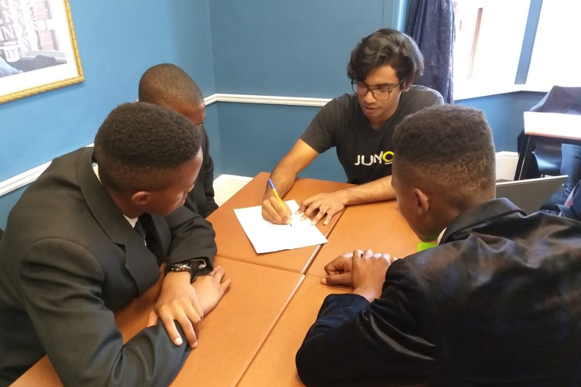
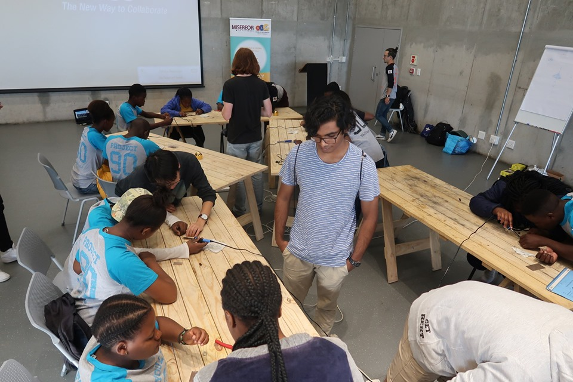

## Welcome, I'm Joash

### A little bit about me
I am a final year Electrical and Computer Engineering student studying at the University of Cape Town. I am passionate for all things computing and how they are continuing to evolve and improve our lives.

I love installing and tinkering with all sorts of open-source projects ranging from Linux distributions, machine learning libraries like mlpack, computer vision libraries like openCV and this website which was built using [Jekyll](https://jekyllrb.com/)

When I am not in front of a computer, I enjoy giving back to the community with Engineers without Borders South Africa. I especially enjoyed organizing and tutoring at their weekly highschool maths and science tutoring programme. Otherwise I enjoy getting coffee with friends or an occassional outdoor run.  

Did you remember to carry the 1? | Don't touch a hot soldering iron!
:-------------------------:|:-------------------------:
 | 

In a few years I'd like to see myself using cutting edge technology and finding new and exciting techniques to squeeze as much performance out of computers as they evolve to meet our ever demanding needs. 

### Reasearching Interests

* FPGA programming
* Machine Learning
* Embedded programming

### Current projects

I am currently investigating edge computing with FPGAs with the current tools I'm using being the Balena stack.
